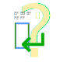

Detextive
=========

<!-- To publish to PowerShell Gallery: dotnet build -t:PublishModule -c Release -->

<!-- Optional badges: -->
<!--  -->
<!--  -->

Investigates data to determine what the textual characteristics are.

<!-- Consider using LICEcap (cinst licecap) to capture a GIF animation of a small PowerShell window showing your module in use. -->

Using the [editorconfig library][] to support [editorconfig][] settings.

[editorconfig library]: https://github.com/editorconfig/editorconfig-core-net "EditorConfig Core library and command line utility written in C# for .NET/Mono http://editorconfig.org"
[editorconfig]: https://editorconfig.org/ "EditorConfig helps maintain consistent coding styles for multiple developers working on the same project across various editors and IDEs."

<!-- [PowerShell dev guidelines]: https://docs.microsoft.com/powershell/scripting/developer/cmdlet/strongly-encouraged-development-guidelines -->

Cmdlets
-------

Documentation is automatically generated using [platyPS](https://github.com/PowerShell/platyPS) (`.\doc.cmd`).

- [Add-Utf8Signature](docs/Add-Utf8Signature.md) — Adds the utf-8 signature (BOM) to a file.
- [Get-FileContentsInfo](docs/Get-FileContentsInfo.md) — Returns whether the file is binary or text, and what encoding, line endings, and indents text files contain.
- [Get-FileEditorConfig](docs/Get-FileEditorConfig.md) — Looks up the editorconfig values set for a file.
- [Get-FileEncoding](docs/Get-FileEncoding.md) — Returns the detected encoding of a file.
- [Get-FileIndents](docs/Get-FileIndents.md) — Returns details about a file's indentation characters.
- [Get-FileLineEndings](docs/Get-FileLineEndings.md) — Returns details about a file's line endings.
- [Remove-Utf8Signature](docs/Remove-Utf8Signature.md) — Removes the utf-8 signature (BOM) from a file.
- [Repair-Encoding](docs/Repair-Encoding.md) — Re-encodes commonly mis-encoded text.
- [Repair-FileEditorConfig](docs/Repair-FileEditorConfig.md) — Corrects a file's editorconfig settings when they differ from the actual formatting found.
- [Test-BinaryFile](docs/Test-BinaryFile.md) — Returns true if a file does not appear to contain parseable text, and presumably contains binary data.
- [Test-FileEditorConfig](docs/Test-FileEditorConfig.md) — Validates a file's editorconfig settings against the actual formatting found.
- [Test-FinalNewline](docs/Test-FinalNewline.md) — Returns true if a file ends with a newline as required by the POSIX standard for text files.
- [Test-TextFile](docs/Test-TextFile.md) — Returns true if a file contains text.
- [Test-Utf8Encoding](docs/Test-Utf8Encoding.md) — Returns true if a file is parseable as UTF-8.
- [Test-Utf8Signature](docs/Test-Utf8Signature.md) — Returns true if a file starts with the optional UTF-8 BOM/signature.
- [Test-Windows1252](docs/Test-Windows1252.md) — Returns true if a file contains at least one byte identified as a likely Windows-1252/CP1252 character value.

Tests
-----

Tests are written for [Pester](https://github.com/Pester/Pester) (`.\test.cmd`).
