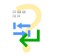
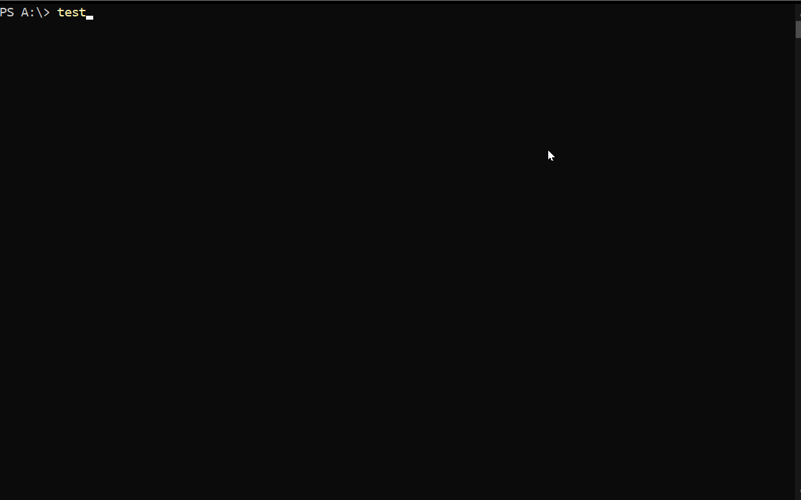

Detextive
=========

Investigates data to determine what the textual characteristics are.

The [ratios][] are still fairly arbirtrary, and will need more sample/test data to mature.
In addition, it may skew anglocentric in assuming primarily US-ASCII characters when
determining encoding based on byte value frequency.

To install: `Install-Module Detextive`

Using the [editorconfig library][] to support [editorconfig][] settings.

[ratios]: src/Detextive/Ratio.fs "Constants used for ratios in byte value data analysis."
[editorconfig library]: https://github.com/editorconfig/editorconfig-core-net "EditorConfig Core library and command line utility written in C# for .NET/Mono http://editorconfig.org"
[editorconfig]: https://editorconfig.org/ "EditorConfig helps maintain consistent coding styles for multiple developers working on the same project across various editors and IDEs."

<!-- [PowerShell dev guidelines]: https://docs.microsoft.com/powershell/scripting/developer/cmdlet/strongly-encouraged-development-guidelines -->

Cmdlets
-------

Documentation is automatically generated using [platyPS](https://github.com/PowerShell/platyPS) (`.\doc.cmd`).

- [Add-Utf8Signature](https://github.com/brianary/Detextive/wiki/Add-Utf8Signature) — Adds the utf-8 signature (BOM) to a file.
- [Get-FileContentsInfo](https://github.com/brianary/Detextive/wiki/Get-FileContentsInfo) — Returns whether the file is binary or text, and what encoding, line endings, and indents text files contain.
- [Get-FileEditorConfig](https://github.com/brianary/Detextive/wiki/Get-FileEditorConfig) — Looks up the editorconfig values set for a file.
- [Get-FileEncoding](https://github.com/brianary/Detextive/wiki/Get-FileEncoding) — Returns the detected encoding of a file.
- [Get-FileIndents](https://github.com/brianary/Detextive/wiki/Get-FileIndents) — Returns details about a file's indentation characters.
- [Get-FileLineEndings](https://github.com/brianary/Detextive/wiki/Get-FileLineEndings) — Returns details about a file's line endings.
- [Remove-Utf8Signature](https://github.com/brianary/Detextive/wiki/Remove-Utf8Signature) — Removes the utf-8 signature (BOM) from a file.
- [Repair-Encoding](https://github.com/brianary/Detextive/wiki/Repair-Encoding) — Re-encodes commonly mis-encoded text.
- [Repair-FileEditorConfig](https://github.com/brianary/Detextive/wiki/Repair-FileEditorConfig) — Corrects a file's editorconfig settings when they differ from the actual formatting found.
- [Test-BinaryFile](https://github.com/brianary/Detextive/wiki/Test-BinaryFile) — Returns true if a file does not appear to contain parseable text, and presumably contains binary data.
- [Test-BrokenEncoding](https://github.com/brianary/Detextive/wiki/Test-BrokenEncoding) — Returns true if text contains a nonsense sequence of characters resulting from parsing text with the wrong encoding.
- [Test-FileEditorConfig](https://github.com/brianary/Detextive/wiki/Test-FileEditorConfig) — Validates a file's editorconfig settings against the actual formatting found.
- [Test-FinalNewline](https://github.com/brianary/Detextive/wiki/Test-FinalNewline) — Returns true if a file ends with a newline as required by the POSIX standard for text files.
- [Test-TextFile](https://github.com/brianary/Detextive/wiki/Test-TextFile) — Returns true if a file contains text.
- [Test-Utf8Encoding](https://github.com/brianary/Detextive/wiki/Test-Utf8Encoding) — Returns true if a file is parseable as UTF-8.
- [Test-Utf8Signature](https://github.com/brianary/Detextive/wiki/Test-Utf8Signature) — Returns true if a file starts with the optional UTF-8 BOM/signature.

Tests
-----

Tests are written for [Pester](https://github.com/Pester/Pester) (`.\test.cmd`).
